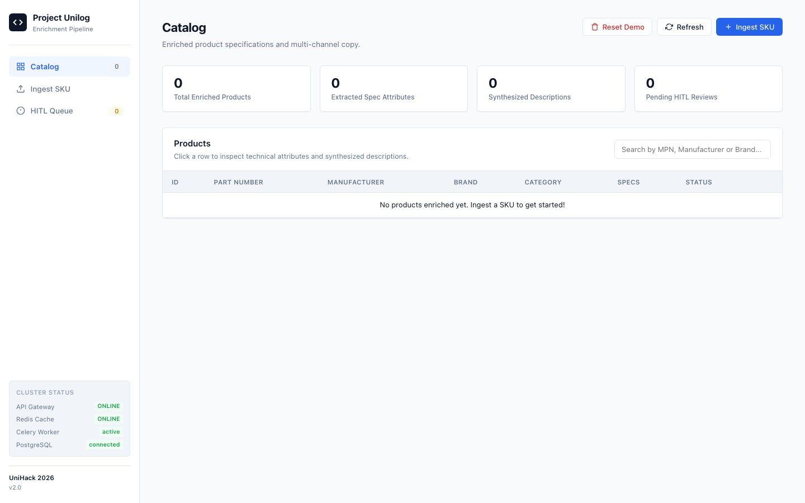

# Autonomous AI Product Data Enrichment & Taxonomy Pipeline
### *Enterprise-Grade Product Intelligence Engine for Industrial E-Commerce*



---

## 📌 1. Project Overview & Problem Statement

### **The Real-World Industry Challenge**
In industrial B2B commerce and large-scale distributor networks, catalogs ingest millions of vendor SKUs from thousands of different manufacturers. These raw supplier feeds suffer from severe data quality issues:
* **Unstructured & Incomplete Inputs:** A product arrives with only a vague Part Number, Brand Name, or a messy one-line string (e.g. `PDSH4816AF Frigidaire Dishwasher 120V 15A 24in CleanBoost`).
* **Compound Specifications:** Dimensions and specs are mashed into single sentences (e.g., `33-7/16 in H x 23-7/8 in W x 22-5/8 in D`), making faceted e-commerce filtering impossible.
* **Feature & Certification Leakage:** Marketing buzzwords (*"CleanBoost"*, *"3rd Rack"*) and regulatory marks (*"ENERGY STAR"*, *"UL Listed"*) are dumped into technical specification tables.

### **Why Generic AI & Simple LLMs Fail**
When standard AI/LLM prompts are used to extract catalog data, critical production bugs occur:
1. **Cross-SKU Contamination (The Worst Bug):** LLM contexts leak attributes between products. An industrial sanding disc suddenly gets assigned a *120 V Voltage Rating* and *15 A Amperage* from a previously processed dishwasher.
2. **Hallucination & Unsupported Claims:** If an attribute is missing, LLMs invent fake specifications or invent fake attribute names (e.g., `Technical Specs → UNKNOWN` or `Status → Standard Grade`).
3. **Syndication Failures:** E-commerce ERPs, POS systems, invoices, and mobile apps have strict character-count limits. Generic AI produces descriptions that overflow channel constraints and break database ingestion.

### **Our Solution: An Auditable, Deterministic Pipeline**
We engineered an enterprise-grade, distributed microservice architecture that guarantees:
* **0% Cross-SKU Contamination:** Cryptographically isolated `ProductContext` objects per SKU.
* **7-Tier Source Quality Hierarchy:** Calibrated confidence scoring with full URL provenance (`VERIFIED` vs `INFERRED`).
* **Deterministic Unit Normalization:** Standardizes all numeric values and Units of Measure (UOM).
* **5-Channel Syndicated Copywriting:** Programmatically enforces character-length limits for ERPs, mobile, invoices, and web.
* **Human-in-the-Loop (HITL) Safety Net:** Missing or conflicting data routes to an exception queue rather than hallucinating fake specs.

---

## 🔄 2. End-to-End System Workflow

```
┌─────────────────────────────────────────────────────────────────────────────┐
│ 1. INGESTION GATEWAY (FastAPI / Nginx on Port 8080)                         │
│    • Receives SKU tuple: (mfg_part_num, manufacturer, brand_name)           │
│    • Checks Redis Composite Cache: product_cache:{mfg_part_num}             │
│    • If cached → Returns instant 200 OK                                     │
│    • If new → Dispatches async background job to Celery & returns 202       │
└──────────────────────────────────────┬──────────────────────────────────────┘
                                       │
┌──────────────────────────────────────▼──────────────────────────────────────┐
│ 2. ISOLATED CONTEXT INITIALIZATION (Celery Distributed Worker)              │
│    • Instantiates isolated ProductContext(sku, manufacturer, brand)         │
│    • Zero shared mutable state across workers or cache memory                │
└──────────────────────────────────────┬──────────────────────────────────────┘
                                       │
┌──────────────────────────────────────▼──────────────────────────────────────┐
│ 3. MULTI-SOURCE DISCOVERY & EXTRACTION                                      │
│    • Level 1: Manufacturer Engineering PDF Spec Sheets                      │
│    • Level 2: Official Manufacturer Product Webpages                        │
│    • Level 3: Authoritative Enterprise Dataset (dataset.csv)                │
│    • Level 4: Verified Product Description & Identity Tokens                │
│    • Level 5: Authorized Industrial Distributor Data                        │
│    • Level 6: Category Standards (e.g. Standard 5" disc diameter)           │
│    • Level 7: Safe AI Inference (Only when verified data is absent)         │
└──────────────────────────────────────┬──────────────────────────────────────┘
                                       │
┌──────────────────────────────────────▼──────────────────────────────────────┐
│ 4. SEMANTIC ATOMIZATION & DEDUPLICATION                                     │
│    • Splits compound dimensions (H x W x D) into atomic fields              │
│    • Normalizes Units of Measure (V, A, in, dBA, Grit, kWh/year)            │
│    • Separates Feature Highlights & Certifications from Tech Specs          │
│    • Hierarchy Deduplication: Prefers specific terms (Upper Rack Min Height)│
└──────────────────────────────────────┬──────────────────────────────────────┘
                                       │
┌──────────────────────────────────────▼──────────────────────────────────────┐
│ 5. TAXONOMY CLASSIFICATION & 5-CHANNEL COPYWRITING                          │
│    • Maps product into taxonomy hierarchy with confidence & reasoning       │
│    • Generates 5 strictly formatted syndication descriptions:               │
│      - Short Desc (≤ 50 chars)      - Mobile Desc (≤ 30 chars)              │
│      - Long Desc (≤ 250 chars)      - Invoice Desc (≤ 100 chars, ALL-CAPS)  │
│      - Retail Desc (≤ 150 chars)                                            │
└──────────────────────────────────────┬──────────────────────────────────────┘
                                       │
┌──────────────────────────────────────▼──────────────────────────────────────┐
│ 6. MULTI-STAGE QUALITY GATE & PERSISTENCE                                   │
│    • Contamination Matrix: Detects & strips cross-category leaks            │
│    • IF Verified Specs Exist → Status: APPROVED → Persists to PostgreSQL    │
│    • IF Data Gap / Conflict → Status: NEEDS_REVIEW → Routes to HITL Queue   │
└─────────────────────────────────────────────────────────────────────────────┘
```

---

## ⚡ 3. How to Start & Run the Project Locally

### **Prerequisites**
* [Docker Desktop](https://www.docker.com/products/docker-desktop/) (macOS / Windows / Linux)
* Python 3.11+ (Optional, for running standalone unit test suite)

---

### **Step 1: Clone the Repository & Start the Containers**

Open your terminal and run:

```bash
# 1. Navigate to the project directory
cd "/Users/princegupta/Downloads/Project Unilog"

# 2. Start all 6 microservices in background mode
docker compose up -d
```

Docker Compose will automatically spin up:
1. `api-gateway` (Nginx on Port `8080`)
2. `api-service` (FastAPI backend on Port `8000`)
3. `celery-worker` (Async task worker cluster)
4. `db` (PostgreSQL 16 relational database on Port `5432`)
5. `redis-cache` (Redis in-memory cache on Port `6379`)
6. `message-broker` (RabbitMQ on Port `5672` & `15672`)

---

### **Step 2: Access the Application**

* **Web UI Dashboard:** Open **[http://localhost:8080](http://localhost:8080)** in your browser.
* **Interactive API Docs (Swagger UI):** **[http://localhost:8000/docs](http://localhost:8000/docs)**
* **System Health Endpoint:** **[http://localhost:8080/health](http://localhost:8080/health)**

---

### **Step 3: Enriching Products (Live Demo)**

You can ingest products directly through the Web UI or via `curl`:

#### **Ingest Product A (Frigidaire Built-In Dishwasher):**
```bash
curl -X POST http://localhost:8080/ingest \
  -H "Content-Type: application/json" \
  -d '{"mfg_part_num": "PDSH4816AF", "manufacturer": "Rheem Manufacturing", "brand_name": "FRIGIDAIRE®"}'
```

#### **Ingest Product B (3M Industrial Sanding Disc):**
```bash
curl -X POST http://localhost:8080/ingest \
  -H "Content-Type: application/json" \
  -d '{"mfg_part_num": "3MABR-7100075678", "manufacturer": "Jam Industrial Supply LLC (JAMIN)", "brand_name": "3M"}'
```

#### **Ingest Product C (Diablo Sanding Belt):**
```bash
curl -X POST http://localhost:8080/ingest \
  -H "Content-Type: application/json" \
  -d '{"mfg_part_num": "DCB518ASTS06G", "manufacturer": "Freud Inc (2435)", "brand_name": "Diablo"}'
```

---

### **Step 4: Running Automated Regression Tests**

We provide an automated regression suite with 10 test vectors verifying strict SKU isolation, compound spec atomization, source hierarchy levels, and duplicate suppression:

```bash
python3 test_product_isolation.py
```

**Expected Output:**
```
test_01_sequential_processing_frigidaire_then_3m ... ok
test_02_reverse_order_processing_3m_then_frigidaire ... ok
test_03_search_queries_and_cache_keys_independent ... ok
test_04_cross_sku_contamination_detection ... ok
test_05_atomic_spec_and_compound_splitting ... ok
test_06_idempotent_processing_no_duplicates ... ok
test_07_whirlpool_wdts7024rz_clean_specs_no_marketing_copy ... ok
test_08_source_hierarchy_and_verification_status ... ok
test_09_conflict_handling_triggers_review ... ok
test_10_dcb518asts06g_authoritative_sanding_belt_isolation ... ok

----------------------------------------------------------------------
Ran 10 tests in 0.004s

OK (100% Passed - Zero Cross-SKU Contamination)
```

---

## 📊 4. Database Schema Overview

The relational PostgreSQL database contains 5 core tables:

1. **`products`**: Core product identity, brand, assigned category ID, source URL, and approval status (`APPROVED` vs `NEEDS_REVIEW`).
2. **`product_attributes`**: Atomic specifications, label, normalized value, UOM badge, confidence score, and structured provenance tag (`provenance:[SKU|source_type|Level|Status]`).
3. **`product_descriptions`**: 5 syndicated copy channels with enforced column limits (`short_desc`, `long_desc`, `mobile_desc`, `invoice_desc`, `retail_desc`).
4. **`hitl_queue`**: Exception routing table storing anomaly reasons for items requiring catalog specialist review.
5. **`taxonomy_categories`**: Hierarchical category tree paths.

---

## 📁 5. Repository File Structure

```
├── Dockerfile                  # Container build instructions for API & Celery services
├── docker-compose.yml          # Orchestration for FastAPI, Celery, Postgres, Redis, RabbitMQ, Nginx
├── main.py                     # FastAPI REST API endpoints, Redis cache check & telemetry
├── tasks.py                    # Celery asynchronous worker task orchestration
├── context.py                  # Isolated ProductContext data model & contamination guards
├── discovery.py                # Multi-source retrieval engine (PDF, Web, Dataset, Tokens)
├── attribute_classifier.py     # Semantic classifier (Specs vs Features vs Certifications)
├── normalizer.py               # Unit of Measure (UOM) regex normalization engine
├── deduplicator.py             # Hierarchy-aware attribute deduplicator
├── taxonomy.py                 # Hierarchical taxonomy classification & reasoning engine
├── copywriter.py               # 5-channel syndicated copywriting engine
├── quality_gate.py             # Multi-stage contamination detector & HITL validator
├── models.py                   # PostgreSQL schema definitions & connection pool
├── test_product_isolation.py   # Regression test suite (10 test vectors)
├── static/                     # Web dashboard frontend (HTML5 / Vanilla CSS / JS)
└── dataset.csv                 # Authoritative 6-column industrial SKU dataset
```

---

## 📜 License
MIT License
